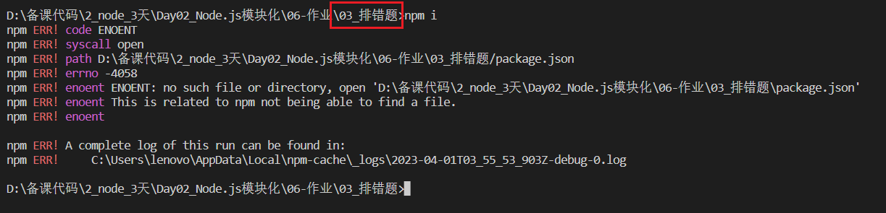

# Node.js 与 Webpack

## 客观题

* 参考客观题目录下的excel

* 在线直接答题：https://ks.wjx.top/vm/Y4tiBHh.aspx# 

  > ps：本测试链接来自问卷星，请不要轻信问卷星广告！


## 主观题

### 作业1 - 性别归类

目标：把准备好的 data.json 文件内的数据，读取处理后，按照性别分类，分别输出到 男.json 和 女.json 2 个 json 文件中，基于作业文件夹内模板代码接着写

```js
[
  { "name": "路飞", "gender": "男" },
  { "name": "索隆", "gender": "男" },
  { "name": "娜美", "gender": "女" },
  { "name": "罗宾", "gender": "女" },
  { "name": "真楷", "gender": "女" },
  { "name": "高阶", "gender": "女" },
  { "name": "小万", "gender": "女" }
]
```

### 作业2 - webpack 支持 Vue 代码

目标：基于作业文件夹内模板代码接着实现，打包并显示网页内容-欢迎了解 Vue 学习即可

提示：百度 vue-loader 使用


## 排错题

### 题目1

配套文件夹内的《题目1_npm 下载依赖有问题》，使用 VSCode 打开此项目

注意：一定要在《题目1_npm 下载依赖有问题》文件夹父级 《03_排错题》，执行 npm i 观察才有问题



请分析问题原因，并说出解决方案！


## 面试题

### 1. 什么是前端工程化？

针对前端项目的工具和流程的优化，提高前端开发效率、协同开发效率、代码质量以及项目可维护性的一种开发方式。

前端工程化方案包括构建工具、自动化测试、代码规范、模块化开发、版本控制等。

参考文档：https://zhuanlan.zhihu.com/p/388216253


### 2. Node.js 和 浏览器执行 JS 代码的区别

浏览器环境，包括浏览器的窗口（BOM）和文档对象模型（DOM）

Node.js 是使用 V8 引擎的 JavaScript 运行时环境，内置的API，如文件系统API，网络API等，这些API可以让开发者更方便地进行服务器端的编程。


### 3. Node.js是什么？它的主要用途是什么？

Node.js是一个基于Chrome V8引擎的JavaScript运行时环境，它允许JavaScript在服务器端运行。Node.js的主要用途是编写服

务器端应用程序，但它也可以用于编写命令行工具、网络工具和桌面应用程序等。


### 4. Node.js中的缓冲区是什么？它们的作用是什么？

缓冲区Buffer 是Node.js中用于处理二进制数据的机制。缓冲区是一个固定大小的内存块，它可以存储任意类型的数据，包括

ASCII、UTF-8和16进制等。缓冲区可以用于处理文件、网络数据和其他I/O操作，它们可以提高数据处理的效率和安全性。


### 5. 什么是 Webpack？

1. webpack是一个javascript的静态模块打包工具
2. webpack里一切文件皆模块，通过loader转换文件，通过plugin注入钩子
3. 最后输出由多个模块组合成的文件，webpack专注构建模块化项目

### 6. Webpack 的优点是什么？

1. 专注于处理模块化的项目，能做到开箱即用，一步到位
2. 通过plugin扩展，完整好用又不失灵活
3. 通过loaders扩展, 可以让webpack把所有类型的文件都解析打包
4. 区庞大活跃，经常引入紧跟时代发展的新特性，能为大多数场景找到已有的开源扩展

### 7. Webpack 的构建流程是什么？

webpack 的运行流程是一个串行的过程，从启动到结束会依次执行以下流程：

1. 初始化参数：从配置文件读取与合并参数，得出最终的参数
2. 开始编译：用上一步得到的参数初始化 Compiler 对象，加载所有配置的插件，开始执行编译
3. 确定入口：根据配置中的 entry 找出所有的入口文件
4. 编译模块：从入口文件出发，调用所有配置的 Loader 对模块进行翻译，再找出该模块依赖的模块，再递归本步骤直到所有入口依赖的文件都经过了本步骤的处理
5. 完成模块编译：在经过第4步使用 Loader 翻译完所有模块后，得到了每个模块被翻译后的最终内容以及它们之间的依赖关系
6. 输出资源：根据入口和模块之间的依赖关系，组装成一个个包含多个模块的 Chunk，再把每个 Chunk 转换成一个单独的文件加入到输出列表，这步是可以修改输出内容的最后机会
7. 输出完成：在确定好输出内容后，根据配置确定输出的路径和文件名，把文件内容写入到文件系统。

在以上过程中，webpack 会在特定的时间点广播出特定的事件，插件在监听到感兴趣的事件后会执行特定的逻辑，并且插件可以调用 webpack 提供的 API 改变 webpack 的运行结果

### 8. 说一下 Webpack 的热更新原理？

​	webpack 的热更新又称热替换（Hot Module Replacement），缩写为 HMR。这个机制可以做到不用刷新浏览器而将新变更的模块替换掉旧的模块。

​    	HMR的核心就是客户端从服务端拉去更新后的文件，准确的说是 chunk diff (chunk 需要更新的部分)，实际上 WDS(webpack-dev-server) 与浏览器之间维护了一个 Websocket，当本地资源发生变化时，WDS 会向浏览器推送更新，并带上构建时的 hash，让客户端与上一次资源进行对比。客户端对比出差异后会向 WDS 发请求来获取更改内容(文件列表、hash)，这样客户端就可以再借助这些信息继续向 WDS 发起 jsonp 请求获取该chunk的增量更新。

​    后续的部分(拿到增量更新之后如何处理？哪些状态该保留？哪些又需要更新？)由 HotModulePlugin 来完成，提供了相关 API 以供开发者针对自身场景进行处理，像react-hot-loader 和 vue-loader 都是借助这些 API 实现 HMR。

### 9. 有哪些常见的 loader？

1. babel-loader：把 ES6 转换成 ES5
2. css-loader：加载 CSS，支持模块化、压缩、文件导入等特性
3. style-loader：把 CSS 代码注入到 JavaScript 中，通过 DOM 操作去加载 CSS

### 10. loader 和 plugin 的区别？

​    Loader直译为"加载器"。webpack将一切文件视为模块，但是webpack原生是只能解析JS和JSON 代码内容，如果想将其他文件也打包的话，就会用到loader。 所以loader的作用是让webpack拥有了加载和解析非JavaScript代码功能。

​    Plugin直译为"插件"。Plugin可以扩展webpack的功能，让webpack具有更多的灵活性。 在 webpack 运行的生命周期中会广播出许多事件，Plugin 可以监听这些事件，在合适的时机通过 webpack 提供的 API 改变输出结果。

​    Loader在module.rules中配置，也就是说他作为模块的解析规则而存在。 类型为数组，每一项都是一个Object，里面描述了对于什么类型的文件（test），使用什么加载(loader)和使用的参数（options）

​    plugin在plugins中单独配置。 类型为数组，每一项是一个plugin的实例，参数都通过构造函数传入。
