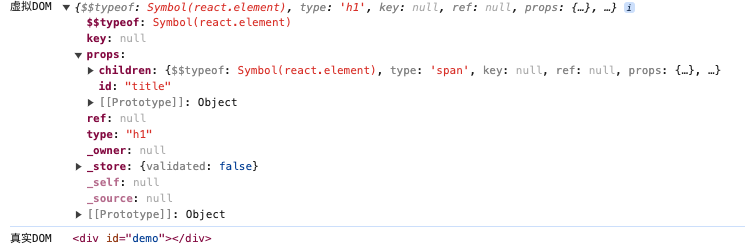
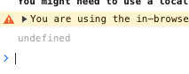
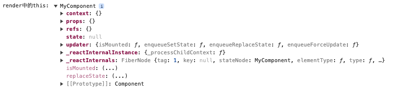

欢迎！
这里是莱斯利学习React的笔记！
---

# React

**react是什么？**

React用于构建用户界面的JS库。是一个将数据渲染为HTML视图的开源JS库。

**为什么学？**

1.原生JS操作DOM繁琐，效率低

2.使用JS直接操作DOM,浏览器会进行大量的重绘重排

3.原生JS没有组件化编码方案，代码复用低

> 在学习之前最好看一下关于npm的知识：
>
> [npm](https://blog.csdn.net/qq_25502269/article/details/79346545)

## Basics

### 01 React 基础案例

1.先导入三个包：

【先引入react.development.js，后引入react-dom.development.js】

``` cmd
react.development.js
react-dom.development.js
babel.min.js 
```

2.创建一个容器

3.创建虚拟DOM，渲染到容器中

``` html
<body>
    <!-- 准备好容器 -->
    <div id="test">

    </div>
</body>
<!-- 引入依赖 ,引入的时候，必须就按照这个步骤-->
<script src="../js/react.development.js" type="text/javascript"></script>
<script src="../js/react-dom.development.js" type="text/javascript"></script>

<script src="../js/babel.min.js" type="text/javascript"></script>

<!--这里使用了babel用来解析jsx语法-->
<script type="text/babel"> /* 此处一定要写babel，用于将jsx翻译成js */
        // 1.创建虚拟DOM
        const VDOM = (  /* 此处一定不要写引号 */
          <h1 id="title">
            <span>Hello,React</span>
          </h1>
        )
        // 2.渲染，如果有多个渲染同一个容器，后面的会将前面的覆盖掉
        ReactDOM.render(VDOM,document.getElementById("test"));        
</script>
</html>
```

这样，就会在页面中的这个div容器上添加这个h1.

用js也可以创建虚拟DOM（不推荐）

```js
const VDOM = React.createElement(
  'h1',
  {id:'title'},
  React.createElement(
    'span',{},'Hello,React'
  )
)

```

### 03-04 JSX基础语法

1.定义虚拟DOM，不能使用“”

2.标签中混入JS表达式的时候使用{}

3.样式的类名指定不要使用class，使用className

4.内联样式要使用双大括号包裹

5.不能有多个根标签，只能有一个跟标签

6.标签必须闭合

7.如果小写字母开头，就将标签转化为html同名元素，如果html中无该标签对应的元素，就报错；如果是大写字母开头，react就去渲染对应的组件，如果没有就报错

---

> 关于JS表达式和JS语句：
> 注意区分：
> 1.表达式：一个表达式会产生一个值，可以放在任何一个需要值的地方
>	  下面这些都是表达式：
>     (1). `a`
>	    (2). `a+b`
>     (3). `demo(1)`
>     (4). `arr.map()`
>	    (5). `function test () {}`
> 2.语句(代码)：
>	    下面这些都是语句(代码)：
>     (1). `if(){}`
>     (2). `for(){}`
>     (3). `switch(){case:xxxx}`

实例如下：

```html
<!DOCTYPE html>
<html lang="en">
<head>
    <meta charset="UTF-8">
    <meta name="viewport" content="width=device-width, initial-scale=1.0">
    <title>Document</title>
    <style>
        .sss{
            color: red;
        }
    </style>
</head>
<body>
    <!-- 准备好容器 -->
    <div id="test">
        
    </div>
</body>
<!-- 引入依赖 ,引入的时候，必须就按照这个步骤-->
<script src="../js/react.development.js" type="text/javascript"></script>
<script src="../js/react-dom.development.js" type="text/javascript"></script>

<script src="../js/babel.min.js"></script>
<!--这里使用了jsx来创建虚拟DOM-->
<script type="text/babel">
        const MyId = "title";
        const MyData = "Cyk";
        // 1.创建虚拟DOM
        const VDOM = (
            <h1 id = {MyId.toLocaleUpperCase()}>
                <span className = "sss" style = {{fontSize:'50px'}}>
                sss
                </span>
            </h1>
        )
        // 2.渲染，如果有多个渲染同一个容器，后面的会将前面的覆盖掉
        ReactDOM.render(VDOM,document.getElementById("test"));
</script>

</html>
```

### 02 虚拟DOM的两种创建方式

**1.使用JSX创建虚拟DOM**

```jsx
 const VDOM = (
            <h1 id = {MyId.toLocaleUpperCase()}>
                <span className = "sss" style = {{fontSize:'50px'}}>sss</span>
            </h1>
        )
```

这个在上面的案例中已经演示过了 ，下面看看另外一种创建虚拟DOM的方式

**2.使用JS创建虚拟DOM**

```js
// 1.创建虚拟DOM[在这使用了js的语法]React.createElement(标签,标签属性,内容)
const VDOM = React.createElement('h1',{id:"title"},"nihao")
```

使用JS和JSX都可以创建虚拟DOM，但是可以看出JS创建虚拟DOM比较繁琐，尤其是标签如果很多的情况下，所以还是比较推荐使用JSX来创建。

#### 真实和虚拟DOM的区别

运行 [这个文件](./01_basics/02_虚拟DOM的两种创建方式/3_虚拟DOM与真实DOM.html) 能在console中看到：



关于虚拟DOM：
  1.本质是Object类型的对象（一般对象）
  2.虚拟DOM比较“轻”，真实DOM比较“重”，因为虚拟DOM是React内部在用，无需真实DOM上那么多的属性。
  3.虚拟DOM最终会被React转化为真实DOM，呈现在页面上。

### 05 组件

当应用是以多组件的方式实现，这个应用就是一个组件化的应用

> **注意：** 组件名称必须以大写字母开头。
>
> React 会将以小写字母开头的组件视为原生 DOM 标签。例如，< div />` 代表 HTML 的 div 标签，而 `< Weclome /> 则代表一个组件，并且需在作用域内使用 `Welcome`
>
> 传递的参数，不能在组件中改动

#### 函数式组件

**例1**

```js
//1.先创建函数，函数可以没有参数，但是必须要有返回值 返回一个虚拟DOM
function Welcome(props) {
  return <h1>Hello, {props.name}</h1>;
}
//2.进行渲染
ReactDOM.Render(<Welcom name = "ss" />,document.getElementById("div"));
```

让我们来回顾一下这个例子中发生了什么：

1. 我们调用 `ReactDOM.render()` 函数，并传入 ` <Welcome name="Sara" /> ` 作为参数。
2. React 调用 `Welcome` 组件，并将 `{name: 'Sara'}` 作为 props 传入。
3. `Welcome` 组件将 `Hello, Sara` 元素作为返回值。
4. React DOM 将 DOM 高效地更新为 `Hello, Sara`。

**例2**

```js
//1.创建函数式组件
function MyComponent(){   //要大写！！！
  console.log(this); //此处的this是undefined，不是window，因为babel编译后开启了严格模式
  return <h2>我是用函数定义的组件(适用于【简单组件】的定义)</h2>
}
//2.渲染组件到页面
ReactDOM.render(<MyComponent/>,document.getElementById('test'))   // 要写标签！
```

执行了`ReactDOM.render(<MyComponent/>.......)`之后，发生了什么？

1. React解析组件标签，找到了MyComponent组件。
2. 发现组件是使用函数定义的，随后调用该函数，将返回的虚拟DOM转为真实DOM，随后呈现在页面中。

#### 类式组件(Class)

```js
//必须继承React.Component
//然后重写Render()方法，该方法一定要有返回值，返回一个虚拟DOM
class Welcome extends React.Component {
  render() {
    return <h1>Hello, {this.props.name}</h1>;
  }
}
//渲染。 这个跟之前也是一样的
ReactDOM.Render(<Welcom name = "ss" />,document.getElementById("div"));
```

让我们来回顾一下这个例子中发生了什么：

1. React解析组件标签，找到相应的组件
2. 发现组件是类定义的，随后new出来的类的实例，并通过该实例调用到原型上的render方法
3. 将render返回的虚拟DOM转化为真实的DOM,随后呈现在页面中

render是放在哪里的？
—— MyComponent的原型对象上，供实例使用。
render中的this是谁？
—— MyComponent的实例对象 <=> MyComponent组件实例对象。

**注意**
`this`关键字：

- 在函数式组件内：
运行 [1_函数式组件.html](./01_basics/05_react中定义组件/1_函数式组件.html) 之后得到 `undefined`，而不是window。因为babel编译后开启了严格模式。


- 在类式组件内：
运行 [2_类式组件.html](./01_basics/05_react中定义组件/2_类式组件.html) 之后得到 类本身的这个东西：

- 

#### 组件案例

下面，我们通过一个案例更好的理解组件：【只关注与核心代码】

我们发现组件是可以包含中使用的， 而且如果创建的数组，必须要代一个key。数组元素中使用的 key 在其兄弟节点之间应该是独一无二的。然而，它们不需要是全局唯一的。当我们生成两个不同的数组时，我们可以使用相同的 key 值

```html
<script type="text/babel">

        //创建一个组件<li>
        function GetLi(props){      
            return <li>{props.value}</li>
        };

        // 1.创建类式组件<ul>
        class MyComponent extends React.Component{
            render(){
                console.log(this.props.arr);
                let com = this.props.arr.map((item,index)=>
                     //在这个地方包含了GetLi这个组件，【注意不能用{}】
                     //因为这个是一个列表，所以必须传递一个key【独一无二的Key】
                     //key 帮助 React 识别哪些元素改变了，比如被添加或删除。
                        <GetLi value={item} key = {index} />
                    );
                console.log(com);
                return <ul>{com}</ul>
            }
        }
        
        let num = [1,2,3,4]
        // 2.渲染组件
        ReactDOM.render(<MyComponent  arr={num}/>,document.getElementById("test"));
</script>
```

### 06-08 组件实例的三大属性

#### state

我们都说React是一个状态机，体现是什么地方呢，就是体现在state上，通过与用户的交互，实现不同的状态，然后去渲染UI,这样就让用户的数据和界面保持一致了。state是组件的私有属性。

在React中，更新组件的state，结果就会重新渲染用户界面(不需要操作DOM),一句话就是说，用户的界面会随着状态的改变而改变。

state是组件对象最重要的属性，值是对象（可以包含多个key-value的组合）

**案例**：

1.需求：页面显示【今天天气很炎热】，鼠标点击文字的时候，页面更改为【今天天气很凉爽】

**A. 复杂写法**
([原文件](./01_basics/06_组件实例三大属性1_state/1_state.html))
要看懂这个文件需要一些js语法中对 [类的基本知识](./01_basics/react所需的js知识/1_类的基本知识.html) 的了解。

```js
//1.创建组件
class Weather extends React.Component{
  
  //构造器调用几次？ ———— 1次
  constructor(props){
    console.log('constructor');
    super(props)
    //初始化状态
    this.state = {isHot:false,wind:'微风'}
    //解决changeWeather中this指向问题
    this.changeWeather = this.changeWeather.bind(this)
    /* 赋值语句 先看右边：实例对象没有changeWeather，所以去原型找，找到了，然后用bind
        把this.changeWeather绑定到（左边）实例对象的this.changeWeatherh上 */
  }

  //render调用几次？ ———— 1+n次 1是初始化的那次 n是状态更新的次数
  render(){
    console.log('render');
    //读取状态
    const {isHot,wind} = this.state
    return <h1 onClick={this.changeWeather}>今天天气很{isHot ? '炎热' : '凉爽'}，{wind}</h1>
  }

  //changeWeather调用几次？ ———— 点几次调几次
  changeWeather(){
    //changeWeather放在哪里？ ———— Weather的原型对象上，供实例使用
    //由于changeWeather是作为onClick的回调，所以不是通过实例调用的，是直接调用
    //类中的方法默认开启了局部的严格模式，所以changeWeather中的this为undefined
    
    console.log('changeWeather');
    //获取原来的isHot值
    const isHot = this.state.isHot
    //严重注意：状态必须通过setState进行更新,且更新是一种合并，不是替换。
    this.setState({isHot:!isHot})
    console.log(this);

    //严重注意：状态(state)不可直接更改，下面这行就是直接更改！！！
    //this.state.isHot = !isHot //这是错误的写法
  }
}
```

需要注意的是：

1. 组件的构造函数，必须要传递一个props参数
2. 特别关注this【重点】，类中所有的方法局部都开启了严格模式，如果直接进行调用，this就是undefined
3. 想要改变state,需要使用setState进行修改，如果只是修改state的部分属性，则不会影响其他的属性，这个只是合并并不是覆盖。

**setState更新状态的2种写法**

this.setState()，该方法接收两种参数：对象或函数。

1. 对象：即想要修改的state
    setState(stateChange, [callback])------对象式的setState
      1.stateChange为状态改变对象(该对象可以体现出状态的更改)
      2.callback是*可选*的回调函数, 它在状态更新完毕、界面也更新后(render调用后)才被调用

2. 函数：接收两个函数:
    第一个函数接受两个参数: 当前state & 当前props.该函数返回一个对象，和直接传递对象参数是一样的，就是要修改的state；
    第二个函数参数是state改变后触发的回调
    setState(updater, [callback])------函数式的setState
      1.updater为返回stateChange对象的函数。
      2.updater可以接收到state和props。
      4.callback是可选的回调函数, 它在状态更新、界面也更新后(render调用后)才被调用。
3. 总结:
    1.对象式的setState是函数式的setState的简写方式(语法糖)
    2.使用原则：
      (1).如果新状态不依赖于原状态 ===> 使用对象方式
      (2).如果新状态依赖于原状态 ===> 使
      (3).如果需要在setState()执行后获取最新的状态数据, 要在第二个callback函数中读取

---

在此还需要注意的是，setState有异步更新和同步更新两种形式，那么什么时候会同步更新，什么时候会异步更新呢？

**React控制之外的事件中调用setState是同步更新的。比如原生js绑定的事件，setTimeout/setInterval等**。所以调用这些方法的时候就是会仍然显示更新前的状态

**大部分开发中用到的都是React封装的事件，比如onChange、onClick、onTouchMove等，这些事件处理程序中的setState都是异步处理的。**

```js
//1.创建组件
class St extends React.Component{
    //可以直接对其进行赋值
    state = {isHot:10};
    render(){     //这里面的This也是实例对象
        return <h1 onClick = {this.changeWeather}>点击事件</h1> 
    }
//箭头函数 [自定义方法--->要用赋值语句的形式+箭头函数]
    changeWeather = () =>{
        //修改isHot
        this.setState({ isHot: this.state.isHot + 1})
        console.log(this.state.isHot);
    }
}
```

上面的案例中预期setState使得isHot变成了11，输出也应该是11。然而在控制台打印的却是10，也就是并没有对其进行更新。这是因为异步的进行了处理，在输出的时候还没有对其进行处理。

```js
componentDidMount(){
    document.getElementById("test").addEventListener("click",()=>{
        this.setState({isHot: this.state.isHot + 1});
        console.log(this.state.isHot);
    })
}
```

但是通过这个原生JS的，可以发现，控制台打印的就是11，也就是已经对其进行了处理。也就是进行了同步的更新。

**React怎么调用同步或者异步的呢？**

在 React 的 setState 函数实现中，会根据一个变量 isBatchingUpdates 判断是直接更新 this.state 还是放到队列中延时更新，而 isBatchingUpdates 默认是 false，表示 setState 会同步更新 this.state；但是，有一个函数 batchedUpdates，该函数会把 isBatchingUpdates 修改为 true，而当 React 在调用事件处理函数之前就会先调用这个 batchedUpdates将isBatchingUpdates修改为true，这样由 React 控制的事件处理过程 setState 不会同步更新 this.state。

**如果是同步更新，每一个setState对调用一个render，并且如果多次调用setState会以最后调用的为准，前面的将会作废；如果是异步更新，多个setSate会统一调用一次render** 参见下面的例子：

```js
changeWeather = () =>{
    this.setState({
        isHot:  1,
        cont:444
    })
    this.setState({
      isHot: this.state.isHot + 1

    })
    this.setState({
        isHot:  888,
        cont:888
    })
}
```

上面的最后会输出：isHot是888，cont是888

```js
 changeWeather = () =>{
                this.setState({
                    isHot: this.state.isHot + 1,
                })
                this.setState({
                    isHot: this.state.isHot + 1,
                })
                this.setState({
                    isHot: this.state.isHot + 888
                })
            }
```

初始isHot为10，最后isHot输出为898，也就是前面两个都没有执行。

**注意！！这是异步更新才有的，如果同步更新，每一次都会调用render，这样每一次更新都会**


**B. 简化写法**

([原文件](./01_basics/06_组件实例三大属性1_state/2_state的简写方式.html))

```js
//1.创建组件
class Weather extends React.Component{
  //初始化状态
  state = {isHot:false,wind:'微风'}

  //自定义方法————要用赋值语句的形式+箭头函数
  changeWeather = ()=>{
    const isHot = this.state.isHot
    this.setState({isHot:!isHot})
  }

  render(){
    const {isHot,wind} = this.state
    return <h1 onClick={this.changeWeather}>今天天气很{isHot ? '炎热' : '凉爽'}，{wind}</h1>
  }
}
```

1. state的赋值可以不在构造函数中进行
2. 使用了箭头函数，将this进行了改变：变成了

```html
<body>
    <!-- 准备好容器 -->
    <div id="test">
        
    </div>
</body>
<!-- 引入依赖 ,引入的时候，必须就按照这个步骤-->
<script src="../js/react.development.js" type="text/javascript"></script>
<script src="../js/react-dom.development.js" type="text/javascript"></script>

<script src="../js/babel.min.js"></script>
<script type="text/babel">
        class St extends React.Component{
            //可以直接对其进行赋值
            state = {isHot:true};
            render(){ //这个This也是实例对象
                return <h1 onClick = {this.dem}>今天天气很{this.state.isHot?"炎热":"凉爽"}</h1>    
                //或者使用{()=>this.dem()也是可以的}
            }
            //箭头函数 [自定义方法--->要用赋值语句的形式+箭头函数]
            dem = () =>{
                console.log(this);
                const state =  this.state.isHot;
                this.setState({isHot:!state});
            }
        }
        ReactDOM.render(<St />,document.getElementById("test"));       
</script>
```

如果想要在调用方法的时候传递参数，有两个方法：

```html
<button onClick={(e) => this.deleteRow(id, e)}>Delete Row</button>
<button onClick={this.deleteRow.bind(this, id)}>Delete Row</button>
```

上述两种方式是等价的，分别通过[箭头函数](https://developer.mozilla.org/en-US/docs/Web/JavaScript/Reference/Functions/Arrow_functions)和 [`Function.prototype.bind`](https://developer.mozilla.org/en-US/docs/Web/JavaScript/Reference/Global_objects/Function/bind) 来实现。

在这两种情况下，React 的事件对象 `e` 会被作为第二个参数传递。如果通过箭头函数的方式，事件对象必须显式的进行传递，而通过 `bind` 的方式，事件对象以及更多的参数将会被隐式的进行传递。

#### Props

参考[源代码](01_basics/07_组件实例三大属性2_props/1_props基本使用.html)

Props主要用来传递数据，比如组件之间进行传值

基本使用：

```html
<body>
    <div id = "div"></div>
</body>
<script type="text/babel">
    class Person extends React.Component{
        render(){
            return (
                <ul>
                    //接受数据并显示
                    <li>{this.props.name}</li>
                    <li>{this.props.age}</li>
                    <li>{this.props.gender}</li>
                </ul>
            )
        }
    }
    //传递数据
    ReactDOM.render(<Person name="tom" age = "41" gender="男"/>,document.getElementById("div"));
</script>
```

如果传递的数据是一个对象，可以更加简便的使用

```html
<script type="text/babel">
    class Person extends React.Component{
        render(){
            return (
                <ul>
                    <li>{this.props.name}</li>
                    <li>{this.props.age}</li>
                    <li>{this.props.gender}</li>
                </ul>
            )
        }
    }
    const p = {name:"张三",age:"18",gender:"女"}
   ReactDOM.render(<Person {...p}/>,document.getElementById("div"));
</script>
```

**展开运算符**
... 这个符号: 这个是一个展开运算符，主要用来展开数组，如下面这个例子：

```js
arr = [1,2,3];
arr1 = [4,5,6];
arr2 = [...arr,...arr1];  //arr2 = [1,2,,3,4,5,6]
```

但是他还有其他的用法：

1. 复制一个对象给另一个对象{...对象名}。此时这两个对象并没有什么联系了
    ```js
    const p1 = {name:"张三", age:"18", gender:"女"}
    const p2 = {...p1};
    p1.name = "sss";
    console.log(p2)  //{name:"张三",age:"18",gender:"女"}
    ```
2. 在复制的时候，合并其中的属性
    ```js
    const p1 = {name:"张三",age:"18",gender:"女"}
    const p2 = {...p1, name: "111",hua:"ss"};
    p1.name = "sss";
    console.log(p2)  //{name: "111", age: "18", gender: "女",hua:"ss"}
    ```
3. 展开运算符总结
   在js中可以使用{...p}来复制一个对象，但是这个地方并不是复制对象，而是babel+react通过展开运算符，展开了一个对象。这只能在标签中进行使用。
   props传递一个对象，是因为babel+react使得`{..p}`可以展开对象，但是只有在标签中才能使用
    ```js
    const p = {name:"张三",age:"18",gender:"女"}
    ReactDOM.render(<Person {...p}/>,document.getElementById("div"));
    ```

**对于props进行限制**
<span style='font-size: 14px;'>参考[源代码](01_basics/07_组件实例三大属性2_props/2_对props进行限制.html)
以及[它的简写形式](01_basics/07_组件实例三大属性2_props/3_props的简写方式.html)
    （*简写实际上就是把对这个类内传递的`props`的限制，从 **类** 外面，写到了 **类** 里面*）
</span>

很多时候都想要传递的参数进行相应的限制，比如：限制传递参数的类型，参数的默认值等等

react对此提供了相应的解决方法：

- propTypes:类型检查，还可以限制不能为空
- defaultProps：默认值

```js
  class Person extends React.Component{
    //对组件的属性对其进行限制
    static propTypes = {
        name:PropTypes.string.isRequired, //限定name是string类型，并且必须要传递
        gender:PropTypes.string,          //限定gender是string类型
        speak:PropTypes.func              //限定speak是function类型
    }
    //指定默认的标签属性
    static defaultProps = {
        gender: "Walmart Bag",
        age:18
    }

    render(){
      //props是只读的
      //this.props.name = 'jack' //此行代码会报错，因为props是只读的
      return (
          <ul>
              <li>{this.props.name}</li>
              <li>{this.props.age}</li>
              <li>{this.props.gender}</li>
          </ul>
      )
    }
  }
  
  function speak(){
    console.log("I\'m speaking")
  }
```

**关于类中的构造器**：
[原文件](./01_basics/07_组件实例三大属性2_props/3_props的简写方式.html)

1. 类中的构造器，能省略则省略
2. 构造器是否接收props，是否传递给super，取决于：是否希望在构造器中通过this访问props。
    但是极其罕见。
    例子：
    ```js
    constructor(props){
        // console.log(props);
        super(props)
        console.log('constructor',this.props);
      }
    ```

**函数式组件的使用**：
函数在使用props的时候，是作为参数进行使用的`props`
[完整代码](01_basics/07_组件实例三大属性2_props/4_函数组件使用props.html)

```js
function Person(props){
  return (
    <ul>
        <li>{props.name}</li>
        <li>{props.age}</li>
        <li>{props.gender}</li>
    </ul>
  )
}
```

#### Refs

Refs 提供了一种方式，允许我们访问 DOM 节点或在 render 方法中创建的 React 元素。

Refs主要提供了三种方式：

**1.字符串形式**
<span style="font-size: 14px">[完整代码](01_basics/08_组件实例三大属性3_refs/1_字符串形式的ref.html)</span>
在想要获取到一个DOM节点，可以直接在这个节点上添加`ref`属性。利用该属性进行获取该节点的值。

案例：给需要的节点添加`ref`属性，此时该实例对象的`refs`上就会有这个值。就可以利用实例对象的`refs`获取已经添加节点的值.
多个`ref`都被存放在同一个`refs`里面了

```js
//展示input1的数据
showData = ()=>{
  const {input1} = this.refs
  alert(input1.value)
}
render(){
  return(
    <div>
      <input ref="input1" type="text" placeholder="点击按钮提示数据"/>&nbsp;
      <button onClick={this.showData}>点我提示input1的数据</button>&nbsp;
    </div>
  )
}
```

**2.回调形式**
<span style="font-size: 14px">[完整代码](01_basics/08_组件实例三大属性3_refs/2_回调函数形式的ref.html)</span>
回调形式会在ref属性中添加一个回调函数。将该DOM作为参数传递过去。

如：ref里面就是一个回调函数，self就是该input标签。然后在将该DOM元素赋值给实例对象中的一个属性

```js
//展示input1的数据
showData = ()=>{
  const {input1} = this
  alert(input1.value)
}
render(){
  return(
    <div>
      <input ref={ c => this.input1=c } type="text" placeholder="点击按钮提示数据"/>&nbsp;
      <button onClick={this.showData}>点我提示input1的数据</button>&nbsp;
    </div>
  )
}
```

也可以将函数提取出来，在ref中进行调用(???这是啥 没看懂)

```js
isRef = (self) =>{
            this.dian = self;
            console.log(self)
        }

<input ref={this.isRef} type="text" placeholder="点击弹出" />
```

**回调ref中回调执行次数的问题*: [完整代码](01_basics/08_组件实例三大属性3_refs/3_回调ref中回调执行次数的问题.html)

**3.API形式**
React其实已经给我们提供了一个相应的API，他会自动的将该DOM元素放入实例对象中

如下：依旧先在DOM元素中添加一个ref元素

```js
{/*<input ref={this.容器名称} type="text" placeholder="点击弹出" />*/}
<input ref={this.MyRef} type="text" placeholder="点击弹出" />
<input ref={this.MyRef1} type="text" placeholder="点击弹出" />
```

通过API，创建React的容器，相当于省略了回调的中间环节。但是这个容器是专门专用的，所以每一个ref都需要创建。
该API会将DOM元素赋值给 *实例对象的名称 = 容器名称* 的`current`属性

```js
// [容器名称] = React.createRef()
MyRef = React.createRef();
MyRef1 = React.createRef();
```

然后就可以使用了

```js
btnOnClick = () =>{
    //创建之后，将自身节点，传入current中
    console.log(this.MyRef.current.value);
}
```
<span style="font-size: 14px">[完整代码](01_basics/08_组件实例三大属性3_refs/4_createRef的使用.html)</span>

**官方提示我们不要过度的使用ref，如果发生时间的元素刚好是需要操作的元素，就可以使用事件去替代。**

### 09 React事件

<span style="font-size: 14px">[完整代码](01_basics/09_react中的事件处理/事件处理.html)</span>

>1. React的事件是通过onXxx属性指定事件处理函数
>     ​ a. React使用的都是自定义(合成)事件, 而不是使用的原生DOM事件
>           为了更好的兼容性
>    b. React中的事件是通过事件委托方式处理的(委托给组件最外层的元素)
>         为了高效
>    事件中必须返回的是函数
>2. 通过event.target得到发生事件的DOM元素对象
>         不要过度使用ref: 如果在同一个对象上，那就可以用event.target.value，不用ref了

比如：
先声明一个事件，然后在根据事件创建相应的函数，根据事件的event参数，将DOM元素获取到。

```js
showData2 = (event)=>{
  alert(event.target.value);
}

render(){
  return(
    <div>
      <input onBlur={this.showData2} type="text" placeholder="失去焦点提示数据"/>
    </div>
  )
}
```

### 10 收集表单数据

**受控和非受控组件**
<span style='color: violet'>受控组件</span>：
 使 React 的 state 成为“唯一数据源”。渲染表单的 React 组件还控制着用户输入过程中表单发生的操作。被 React 以这种方式控制取值的表单输入元素就叫做“受控组件”。

```js
saveName = (event) =>{
    this.setState({name:event.target.value});
}

savePwd = (event) => {
    this.setState({pwd:event.target.value});
}

render() {
    return (
        <form action="http://www.baidu.com" onSubmit={this.login}>
            用户名：<input value={this.state.name} onChange={this.saveName} type = "text" />
            密码<input value={this.state.pwd} onChange={this.savePwd} type = "password"/>
            <button>登录</button>
        </form>
    )
}
```

<span style="font-size: 13px">（[完整代码](01_basics/10_react中收集表单数据/2_受控组件.html)）<span>

由于在表单元素上设置了 `value` 属性，因此显示的值将始终为 `this.state.value`，这使得 React 的 state 成为唯一数据源。由于 `onchange` 在每次按键时都会执行并更新 React 的 state，因此显示的值将随着用户输入而更新。

对于受控组件来说，输入的值始终由 React 的 state 驱动。

<span style='color: violet'>非受控组件</span>：
非受控组件其实就是表单元素的值不会更新state。输入数据都是现用现取的。
如下：下面并没有使用state来控制属性，使用的是事件来控制表单的属性值。

```js
class Login extends React.Component{
  login = (event) =>{
    event.preventDefault(); // 阻止表单提交 // 暂时用一下来防止报错
    const {username,password} = this
    alert(`你输入的用户名是：${username.value},你输入的密码是：${password.value}`)
  }
  render() {
      return (
          <form onSubmit={this.login}>
          用户名：<input ref = {c => this.name=c } type = "text" name ="username"/>
          密码：<input ref = {c => this.pwd=c } type = "password" name ="password"/>
          <button>登录</button>
          </form>
      )
  }
}
```

<span style="font-size: 13px">（[完整代码](01_basics/10_react中收集表单数据/1_非受控组件.html)）</span>

### 11 函数柯里化

**高级函数**
如果一个函数符合下面2个规范中的任何一个，那该函数就是高阶函数。

  1. 若A函数，接收的参数是一个函数，那么A就可以称之为高阶函数。
  2. 若A函数，调用的返回值依然是一个函数，那么A就可以称之为高阶函数。

  常见的高阶函数有：`Promise`、`setTimeout`、`arr.map()`等等

**函数的柯里化**
通过函数调用继续返回函数的方式，实现多次接收参数最后统一处理的函数编码形式

```js
function sum(a){
  return(b)=>{
    return (c)=>{
      return a+b+c
    }
  }
}
```

我们将上面的 *Login案例(受控版)* 简化，创建高级函数：<span style="font-size: 13px">（[完整代码](01_basics/11_高阶函数_函数柯里化/1_高阶函数_函数柯里化.html)）</span>

```js
class Login extends React.Component{
  //初始化状态
  state = {
    username:'',
    password:''
  }
  //保存表单数据到状态中
  saveFormData = (dataType)=>{
    return (event) => {
      this.setState({[dataType]:event.target.value})
    }
  }
  //表单提交的回调
  handleSubmit = (event)=>{
    event.preventDefault() //阻止表单提交
    const {username,password} = this.state
    alert(`你输入的用户名是：${username},你输入的密码是：${password}`)
  }
  render(){
    return(
      <form onSubmit={this.handleSubmit}>
        用户名：<input onChange={this.saveFormData('username')} type="text" name="username"/>
        密码：<input onChange={this.saveFormData('password')} type="password" name="password"/>
        <button>登录</button>
      </form>
    )
  }
}
```

不用函数柯里化的实现 <span style="font-size: 13px">（[完整代码](01_basics/11_高阶函数_函数柯里化/2_不用函数柯里化的实现.html)）</span>
只需要改一下`saveFormData` 函数：

```js
//保存表单数据到状态中
saveFormData = (dataType,event)=>{
  this.setState({[dataType]:event.target.value})
}
```

### 12 生命周期

#### （旧）

1. 组件从创建到死亡，会经过一些特定的阶段
2. React组件中包含一系列钩子函数{生命周期回调函数}，会在特定的时刻调用
3. 我们在定义组件的时候，会在特定的声明周期回调函数中，做特定的工作

如下图是旧生命周期的结构图：

.png)

我们通过一个案例更详细地了解这个生命周期： <span style="font-size: 13px">（[完整代码](01_basics/12_组件的生命周期/2_react生命周期(旧).html)）</span>

```js
...写到这里
```

我们在控制台看一下：

当我们刚刚打开控制台的时候，组件第一次加载：


当我们点击按钮更新state的时候：


#### （新）

在最新的react版本中，有些生命周期钩子被抛弃了，在官网中是这样说的：

我们得到最重要的经验是，过时的组件生命周期往往会带来不安全的编码实践，具体函数如下：

- `componentWillMount`
- `componentWillReceiveProps`
- `componentWillUpdate`

这些生命周期方法经常被误解和滥用；此外，我们预计，在异步渲染中，它们潜在的误用问题可能更大。我们将在即将发布的版本中为这些生命周期添加 “UNSAFE_” 前缀。（这里的 “unsafe” 不是指安全性，而是表示使用这些生命周期的代码在 React 的未来版本中更有可能出现 bug，尤其是在启用异步渲染之后。）

由此可见，新版本中并不推荐持有这三个函数，取而代之的是带有UNSAFE_ 前缀的三个函数，比如: UNSAFE_ componentWillMount。即便如此，其实React官方还是不推荐大家去使用，在以后版本中有可能会去除这几个函数。

如下图是新的生命周期：

.png)

从图上可以看出，新生命周期和旧生命周期的区别主要有：

1.抛弃了上面所说的三个钩子函数【其实还可以使用】

2.新添加了两个钩子函数

现在重点说一下，新添加的钩子函数

**static getDerivedStateFromProps(props, state)**

首先，该函数会调用 render 方法之前调用，并且在初始挂载及后续更新时都会被调用；该函数必须是静态的；给组件传递的数据（props）以及组件状态（state），会作为参数到这个函数中；该函数也必须有返回值，返回一个Null或者state对象。因为初始化和后续更新都会执行这个方法，因此在这个方法返回state对象，就相当于将原来的state进行了覆盖，所以倒是修改状态不起作用。

**getSnapshotBeforeUpdate(prevProps, prevState)**

 `getSnapshotBeforeUpdate()` 在最近一次渲染输出（提交到 DOM 节点）之前调用。它使得组件能在发生更改之前从 DOM 中捕获一些信息（例如，滚动位置）。此生命周期的任何返回值将作为参数传递`componentDidUpdate()`。 

> 补充一下：componentDidUpdate(prevProps, prevState, snapshot)
>
> 该生命周期函数，可以有三个参数：原始传过来的参数，最开始的状态，getSnapshotBeforeUpdate传递的值
>
> 关于更多关于生命周期的介绍，可以参考官方文档：
>
> https://zh-hans.reactjs.org/docs/react-component.html#render

以上就是两个新添加的钩子函数，但是在现实开发中可能并不常用这两个。

**案例：在一个区域内，定时的输出以行话，如果内容大小超过了区域大小，就出现滚动条，但是内容不进行移动 **


如上面的动图：区域内部的内容展现没有变化，但是可以看见滚动条在变化，也就是说上面依旧有内容在输出，只不过不在这个区域内部展现。

**实现：**

【一些css样式，就不在这展示了】

1.首先我们先实现定时输出内容

我们可以使用state状态，改变新闻后面的值，但是为了同时显示这些内容，我们应该为state的属性定义一个数组。并在创建组件之后开启一个定时器，不断的进行更新state。更新渲染组件

```js
 class New extends React.Component{

        state = {num:[]};

        //在组件创建之后,开启一个定时任务
        componentDidMount(){
            setInterval(()=>{
                let {num} = this.state;
                const news = (num.length+1);
                this.setState({num:[news,...num]});
            },2000);
        }

        render(){
            return (

                <div ref = "list" className = "list">{
                    this.state.num.map((n,index)=>{
                    return <div className="news" key={index} >新闻{n}</div>
                    })
                }</div>
            )
        }
  }
  ReactDOM.render(<New />,document.getElementById("div"));

```

2.接下来就是控制滚动条了

我们在组件渲染到DOM之前获取组件的高度，然后用组件渲染之后的高度减去之前的高度就是一条新的内容的高度，这样在不断的累加到滚动条位置上。

```html
getSnapshotBeforeUpdate(){
	return this.refs.list.scrollHeight;
}

componentDidUpdate(preProps,preState,height){
	this.refs.list.scrollTop += (this.refs.list.scrollHeight - height);
}
```

这样就实现了这个功能。

### 13 Diff算法

提到这个算法，就必须说一下关于Key的事情了。

其实每个组件中的每个标签都会有一个key,只不过有的必须显示的指定，有的可以隐藏。

 如果生成的render出来后就不会改变里面的内容，那么你不需要指定key（不指定key时，React也会生成一个默认的标识）,或者将index作为key，只要key不重复即可。

但是如果你的标签是动态的，是有可能刷新的，就必须显示的指定key。必须上面案使用map进行便利的时候就必须指定Key:

```html
this.state.num.map((n,index)=>{
	return <div className="news" key={index} >新闻{n}</div>
})
```

这个地方虽然显示的指定了key，但是**官网并不推荐使用Index作为Key去使用**；

这样会很有可能会有效率上的问题

举个例子：

在一个组件中，我们先创建了两个对象，通过循环的方式放入< li>标签中，此时key使用的是index。

```html
person:[
    {id:1,name:"张三",age:18},
    {id:2,name:"李四",age:19}
]

this.state.person.map((preson,index)=>{
  return  <li key = {index}>{preson.name}</li>
})
```

如下图展现在页面中：


此时，我们想在点击按钮之后动态的添加一个对象，并且放入到li标签中，在重新渲染到页面中。

我们通过修改State来控制对象的添加。

```html
<button onClick={this.addObject}>点击增加对象</button>
addObject = () =>{
    let {person} = this.state;
    const p = {id:(person.length+1),name:"王五",age:20};
    this.setState({person:[p,...person]});
}
```

如下动图所示：

  

这样看，虽然完成了功能。但是其实存在效率上的问题，	我们先来看一下两个前后组件状态的变化：


我们发现，组件第一个变成了王五，张三和李四都移下去了。因为我们使用Index作为Key，这三个标签的key也就发生了改变【张三原本的key是0，现在变成了1，李四的key原本是1，现在变成了2，王五变成了0】在组件更新状态重新渲染的时候，就出现了问题：

因为react是通过key来比较组件标签是否一致的，拿这个案例来说：

首先，状态更新导致组件标签更新，react根据Key，判断旧的虚拟DOM和新的虚拟DOM是否一致

key = 0 的时候 旧的虚拟DOM 内容是张三  新的虚拟DOM为王五 ，react认为内容改变，从而重新创建新的真实DOM.

key = 1 的时候 旧的虚拟DOM 内容是李四，新的虚拟DOM为张三，react认为内容改变，从而重新创建新的真实DOM

key = 2 的时候 旧的虚拟DOM没有，创建新的真实DOM 

这样原本有两个虚拟DOM可以复用，但都没有进行复用，完完全全的都是新创建的；这就导致效率极大的降低。

其实这是因为我们将新创建的对象放在了首位，如果放在最后其实是没有问题的，但是因为官方并不推荐使用Index作为key值，我们推荐使用id作为key值。从而完全避免这样的情况。

**用index作为key可能会引发的问题:**

1。若对数据进行:逆序添加、逆序删除等破坏顺序操作:

​		会产生没有必要的真实DOM更新  界面效果没问题,但效率低。

2．如果结构中还包含输入类的DOM:

​        会产生错误DOM更新   界面有问题。

3，注意! 如果不存在对数据的逆序添加、逆序删除等破坏顺序操作，仅用于渲染列表用于展示，使用index作为key是没有问题的。

**开发如何选择key?**

最好使用每一条数据的唯一标识作为key 比如id，手机号，身份证号

如果确定只是简单的展示数据，用Index也是可以的

**而这个判断key的比较规则就是Diff算法**

Diff算法其实就是react生成的新虚拟DOM和以前的旧虚拟DOM的比较规则：

- 如果旧的虚拟DOM中找到了与新虚拟DOM相同的key:
  - 如果内容没有变化，就直接只用之前旧的真实DOM
  - 如果内容发生了变化，就生成新的真实DOM			

- 如果旧的虚拟DOM中没有找到了与新虚拟DOM相同的key:
  - 根据数据创建新的真实的DOM,随后渲染到页面上


## 其他 （待整合）

## Hooks

### 1. React Hook/Hooks是什么?

(1). Hook是React 16.8.0版本增加的新特性/新语法
(2). 可以让你在函数组件中使用 state 以及其他的 React 特性

### 2. 三个常用的Hook

(1). State Hook: React.useState()
(2). Effect Hook: React.useEffect()
(3). Ref Hook: React.useRef()

### State Hook

```
(1). State Hook让函数组件也可以有state状态, 并进行状态数据的读写操作
(2). 语法: const [xxx, setXxx] = React.useState(initValue)  
(3). useState()说明:
        参数: 第一次初始化指定的值在内部作缓存
        返回值: 包含2个元素的数组, 第1个为内部当前状态值, 第2个为更新状态值的函数
(4). setXxx()2种写法:
        setXxx(newValue): 参数为非函数值, 直接指定新的状态值, 内部用其覆盖原来的状态值
        setXxx(value => newValue): 参数为函数, 接收原本的状态值, 返回新的状态值, 内部用其覆盖原来的状态值
```

#### Effect Hook

```
(1). Effect Hook 可以让你在函数组件中执行副作用操作(用于模拟类组件中的生命周期钩子)
(2). React中的副作用操作:
        发ajax请求数据获取
        设置订阅 / 启动定时器
        手动更改真实DOM
(3). 语法和说明:
        useEffect(() => {
          // 在此可以执行任何带副作用操作
          return () => { // 在组件卸载前执行
            // 在此做一些收尾工作, 比如清除定时器/取消订阅等
          }
        }, [stateValue]) // 如果指定的是[], 回调函数只会在第一次render()后执行

(4). 可以把 useEffect Hook 看做如下三个函数的组合
      componentDidMount()
      componentDidUpdate()
      componentWillUnmount()
```

#### Ref Hook

```
(1). Ref Hook可以在函数组件中存储/查找组件内的标签或任意其它数据
(2). 语法: const refContainer = useRef()
(3). 作用:保存标签对象,功能与React.createRef()一样
```

---

## Staging

### 01 脚手架

### 02 [hello react](02_staging/02_src_hello_react/README.md)

**使用方法：**
把文件夹名字改成`src` 然后 `npm start`。以下文件夹同理。

**知识点：样式的模块化**
看/component/Hello下的两个文件：
[index.jsx](02_staging/02_src_hello_react/components/Hello/index.jsx)
[index.module.css](02_staging/02_src_hello_react/components/Hello/index.module.css)

index.css变成了index.module.css
这叫做**样式的模块化**

可以避免components间样式的冲突

这样改名之后在 Hello/index.js里面的import语句也有变化
 `import hello from "./index.module.css"`
在calssName里的样式名之前也要加上类名
className = {hello.title}

当然如果用less之后就同样可以避免这个问题，并且不用改名

### 03 todoList 案例

1. 拆分组件、实现静态组件，注意：className、style的写法
2. 动态初始化列表，如何确定将数据放在哪个组件的state中？
      ——某个组件使用：放在其自身的state中
      ——某些组件使用：放在他们共同的父组件state中（官方称此操作为：状态提升）
3. 关于父子之间通信：
    1.【父组件】给【子组件】传递数据：通过props传递
    2.【子组件】给【父组件】传递数据：通过props传递，要求父提前给子传递一个函数
4. 注意defaultChecked 和 checked的区别，类似的还有：defaultValue 和 value
5. 状态在哪里，操作状态的方法就在哪里

### 04 配置代理

[代码](02_staging/04_src_配置代理/App.jsx) 中，我们使用了方法二

##### 我的问题：
我没听懂在github那个案例里面要怎么配置CORS跨域的代理。会报错诶
b站视频第68p

#### 方法一

> 在package.json中追加如下配置

```json
"proxy":"http://localhost:5000"
```

说明：

1. 优点：配置简单，前端请求资源时可以不加任何前缀。
2. 缺点：不能配置多个代理。
3. 工作方式：上述方式配置代理，当请求了3000不存在的资源时，那么该请求会转发给5000 （优先匹配前端资源）

#### 方法二

1. 第一步：创建代理配置文件
    在src下创建配置文件： `src/setupProxy.js`
    [setupProxy.js文件链接](02_staging/04_src_配置代理/setupProxy.js)

2. 编写setupProxy.js配置具体代理规则：

   ```js
   const proxy = require('http-proxy-middleware')
   
   module.exports = function(app) {
     app.use(
       proxy('/api1', {  //api1是需要转发的请求(所有带有/api1前缀的请求都会转发给5000)
         target: 'http://localhost:5000', //配置转发目标地址(能返回数据的服务器地址)
         changeOrigin: true, //控制服务器接收到的请求头中host字段的值
         /*
         	changeOrigin设置为true时，服务器收到的请求头中的host为：localhost:5000
         	changeOrigin设置为false时，服务器收到的请求头中的host为：localhost:3000
         	changeOrigin默认值为false，但我们一般将changeOrigin值设为true
         */
         pathRewrite: {'^/api1': ''} //去除请求前缀，保证交给后台服务器的是正常请求地址(必须配置)
       }),
       proxy('/api2', { 
         target: 'http://localhost:5001',
         changeOrigin: true,
         pathRewrite: {'^/api2': ''}
       })
     )
   }
   ```

说明：

1. 优点：可以配置多个代理，可以灵活的控制请求是否走代理。
2. 缺点：配置繁琐，前端请求资源时必须加前缀。

注意：

1. 测试时需要一个 `http://localhost:5000` 的server(s)，放在 [02_staging/04_src_配置代理/servers](02_staging/04_src_配置代理/servers/server1.js) 下了
2. 打开文件夹后运行：`npm start`

### 05 - 07 GitHub案例

案例题目：将 [GitHub案例静态页面](02_staging/05_GitHub案例静态页面/index.html) 内的 html css 文件改写成 React

这个案例我们进行了配置代理的应用，使用了三种方法：

1. axios
2. PubSub
3. fetch

考点：

1. CORS
2. fetch的特殊性：不使用 xhr 也能进行request

#### 方法一 axios

**React组件间通讯的思路:**

本案例实现兄弟间通讯的方式需要通过父组件 `app.jsx`。所以 state 储存在 app.jsx 中。

1. [`SearchBar`](02_staging/05_src_有笔记版/components/SearchBar/index.jsx) 中：
    点击 `<button>` 来search，所以写一个 search 方法。search 方法内获取用户的输入是通过 `ref` 箭头函数的方法，从 `<input>` 元素中获取，储存在 `keyWordElement` 中。其中使用了**连续解构赋值**的方法：

    ```js
    const { keywordElement: { value } } = this;
    ```

    这样写可以同时直接获得 keywordElement 和 value。

    通过调用父组件通过 props 传入的 updateAppState 方法，将数据传给父组件 `app.jsx`：

    ```js
        // send request
        axios.get(`https://api.github.com/search/users?q=${value}`).then(
          response => { 
            this.props.updateAppState({ users: response.data.items, isLoading: false});
          },
          error => { 
            this.props.updateAppState({ err: error.message, isLoading: false });
            // IMPORTANT 要保存error中的message而不是error本身。因为error本身是一个object，在报错时整个网页都会出错
          }
        )
    ```

    **我的问题：**
    视频[第68p](https://www.bilibili.com/video/BV1wy4y1D7JT?p=68&vd_source=1df467a5303aad1fcd0839b54c44ab4e) 17分钟左右 讲了跨域的处理方法 CORS。他写了一个NodeJS文件来给出解决方案。在[这里](/02_staging/05_src_有笔记版/server/server.js)。是我看不懂也不会用的。一用就报错，可能需要维护了。
    他[源代码](/02_staging/05_src_github搜索案例_axios/components/Search/index.jsx) 里不是用的 `https://api.github.com/search/users?q=${value}`，用的是 CORS 处理过的第二种配置代理的方法

2. 父组件 [`app.jsx`](02_staging/05_src_有笔记版/App.jsx)中：
收到 `SearchBar` 通过 `updateAppState` 传来的数据，在本方法中更新 state。

3. [`List`](02_staging/05_src_有笔记版/components/List/index.jsx)中：
直接使用更新过后的 state，进行渲染。

Tips
由于使用了 axios，这个方法无法进行兄弟间通讯，所以要统一传递给`app.jsx`。下面这个 PubSub 方法可以避免这样的麻烦，state能直接存在要使用的组件 `List`中。

#### 方法二 PubSub

工具库：PubSubJS

安装： `npm install pubsub-js --save`

使用：

1) 引入 `import PubSub from 'pubsub-js'`
2) 订阅 `PubSub.subscribe('delete', function(data){ });`
3) 发布消息 `PubSub.publish('delete', data)`

案例中：

1. [`App.jsx`](02_staging/06_src_我的笔记版/App.jsx)中：
    啥也没有。

2. [`SearchBar`](02_staging/06_src_我的笔记版/components/SearchBar/index.jsx)中：
    1) 还是通过 `ref` 箭头函数的方法获取用户输入, 也还是使用 axios来 send request

    ```js
    const { keywordElement: {value: keyWord } } = this
    
    // this.props.updateAppState({ isFirst: false, isLoading: true })
    
    axios.get(`https://api.github.com/search/users?q=${keyWord}`).then(
      response => { 
        // this.props.updateAppState({ users: response.data.items, isLoading: false});
       },
      error => { 
        // this.props.updateAppState({ err: error.message, isLoading: false });
       }
    )
    ```

    但是我们不再使用兄弟间通讯的方式了。已经被注注释掉了。下面写成 PubSub的方法：

    ```js
     const { keywordElement: {value: keyWord } } = this
    
    //发送请求前通知 List 更新状态
    PubSub.publish('hi', { isFirst: false, isLoading: true })
    
    axios.get(`https://api.github.com/search/users?q=${keyWord}`).then(
      response => { 
        PubSub.publish('hi', { users: response.data.items, isLoading: false })
       },
      error => { 
        PubSub.publish('hi', { err: error.message, isLoading: false });
       }
    )
    ```

3. [`List`](02_staging/06_src_我的笔记版/components/List/index.jsx)中：
    state存在这里啦！好方便！
    我们需要订阅 发布的消息 才能使用：

    ```js
    // 因为消息订阅发生在，刚刚渲染好的时候。所以我们用生命周期的钩子来订阅
      componentDidMount() {
        this.token = PubSub.subscribe('hi', (msg, stateObj) => {
          this.setState(stateObj)
        })
      }
    
    // 需要在结束的时候取消订阅
    componentWillUnmount() {
      PubSub.unsubscribe(this.token)
    }
    ```

#### 方法三 fetch （YFI）

我们知道，jQuery 和 axios 本质上都是封装了 XmlHttpRequest 来发送 ajax 请求。除此之外还有一个 js 自带的工具 fetch：

1. 是原生函数。不使用 XmlHttpRequest 也能发送 ajax 请求。
2. 缺点：老版本浏览器可能不支持。所以使用率并不高。

考点：没有xhr就不能发送请求了吗？不是的，还可以用 fetch

[源代码](/02_staging/07_src_我的笔记版/components/SearchBar/index.jsx)

参考文章：
<https://segmentfault.com/a/1190000003810652>

1. 未优化版本：
    使用 `.then(response => {...}, error => {...})` 

    ```js
    fetch(`https://api.github.com/search/users?q=${keyWord}`).then(
      response => {
        console.log('联系服务器成功了');
        return response.json()
      },
      error => {
        console.log('联系服务器失败了',error);
        return new Promise(()=>{})  // 这句话用于停止后续的 then 继续执行
      }
    ).then(
      response => {console.log('获取数据成功了',response);},
      error => {console.log('获取数据失败了',error);}
    )
    ```

    这里要写两个then，第一个尝试联系服务器，第二个尝试获取数据
    这就是 关注分离 (Separation of Concerns)
    我们在第一个then内写了返回值（而且是promise实例），第二个then内会收到第一个then内的返回值。

    上面的语句 `return new Promise(()=>{})` 的解析：
    因为联系服务器失败时会返回 undefined，这不是一个Promise对象。（Promise知识点：当一个 then 返回一个非Promise对象时，我们会默认这个返回值是成功的。）所以这个 undefined 返回值会导致后面执行‘获取数据成功了’，不是我们期望的。所以我们强行返回一个Promise对象，在这里停下来。

2. 优化版本A
    给关注分离后的代码 统一处理 error。使用 `.catch(error => {})`

    ```js
    fetch(`https://api.github.com/search/users?q=${keyWord}`).then(
      response => {
        console.log('联系服务器成功了');
        return response.json()
      }
    ).then(
      response => {console.log('获取数据成功了',response);}
    ).catch(
      error => { console.log('Somthing went wrong'); }
    )
    ```

3. 优化版本B
    思路：
      1) `fetch` 没必要非得用 `.then` 方法，可以用 `async` `await`
      2) 在用`try {...} catch (error {...})` 处理错误

    ```js
    search = async() => {
      try {
        const response = await fetch(`https://api.github.com/search/users?q=${keyWord}`)
        console.log(response)
        const data = await response.json()
        console.log(data)
        PubSub.publish('hi', {isLoading: false, users: data.items})
      } catch (error) {
        console.log('reuqest failed', error)
        PubSub.publish('hi', {isLoading: false, err: error.message})
      }
    }
    ```

    **注意！**
    之前我们的 search 方法没有 `async` 关键字，这里我们使用 `await` 就必须要在 `await` 外面的函数体加上 `async`.

#### GitHub案例 总结

1. 设计状态时要考虑全面，例如带有网络请求的组件，要考虑请求失败怎么办。

2. ES6小知识点：解构赋值+重命名

3. Promise 知识点：返回值的特性

4. 消息订阅与发布机制
      1.先订阅，再发布（理解：有一种隔空对话的感觉）
      2.适用于任意组件间通信
      3.要在组件的componentWillUnmount中取消订阅

5. fetch发送请求（关注分离的设计思想）
      try {
        const response= await fetch(`/api1/search/users2?q=${keyWord}`)
        const data = await response.json()
        console.log(data);
      } catch (error) {
        console.log('请求出错',error);
      }

6. async await 知识点


### 08 路由的基本使用

**理解**：

```
SPA 的理解
    1. 单页 Web 应用(single page web application，SPA)。
    2. 整个应用只有一个完整的页面。
    3. 点击页面中的链接不会刷新页面，只会做页面的局部更新。
    4. 数据都需要通过 ajax 请求获取, 并在前端异步展现。

路由的理解
    1. 什么是路由?
        1. 一个路由就是一个映射关系(key:value)
        2. key 为路径, value 可能是 function 或 component
    2. 路由分类
        1. 后端路由:
            1) 理解: value 是 function, 用来处理客户端提交的请求。
            2) 注册路由: router.get(path, function(req, res))
            3) 工作过程:当 node 接收到一个请求时, 根据请求路径找到匹配的路由, 调用路
        由中的函数来处理请求, 返回响应数据
            2. 前端路由:
            1) 浏览器端路由，value 是 component，用于展示页面内容。
            2) 注册路由: `<Route path="/test" component={Test}>`
            3) 工作过程:当浏览器的 path 变为/test 时, 当前路由组件就会变为 Test 组件
```

**工作原理**：
BOM里 本身有 `history`，用于记录网页浏览的历史。
基本方法有：
`history.push(path)`
`history.replace(path)`
`history.goBack()`
`history.goForward()`
`history.listen([callback])`

但是它本身不太好用。我们在这里引入一个库，也叫做history。它本质上也是使用了 BOM 的 history。

```html
<script type="text/javascript" src="https://cdn.bootcss.com/history/4.7.2/history.js"></script>
```

下面我们就能在js里使用history了。有两种方法：

1. 方法一，直接使用H5推出的history身上的API。但是有一些旧的浏览器不支持.
    `let history = History.createBrowserHistory()`
2. 方法二，hash值（锚点）
    `let history = History.createHashHistory()`
    运行后，网址后面会有一个井号：*http://www.atguigu.com#*
    并且在点击跳转之后还是会带有这个井号。
    这个虽然有点丑，但是很万能。

**基本使用**：

[完整代码](/02_staging/08_src_我的笔记版/App.jsx)

1. 明确好界面中的导航区、展示区
2. 导航区的a标签改为Link标签（并且把 href属性 改成 to属性）:  `<Link to="/xxxxx">Demo</Link>`
    ```js
    {/* 原生html中，靠<a>跳转不同的页面 */}
    {/* <a className="list-group-item" href="./about.html">About</a>
    <a className="list-group-item active" href="./home.html">Home</a> */}
    
    {/* 在 react 中靠路由链接实现切换组件 - 编写路由链接 */}
    <Link className='list-group-item' to="/about">About</Link>
    <Link className='list-group-item' to="/home">About</Link>
    ```
    to 属性的**注意**点：
        1. to 属性 表示跳转到什么页面。
        2. 杠前不要带点。
        3. 因为它不区分大小写，所以为了统一最好是小写
3. 展示区写Route标签进行路径的匹配:  
    `<Route path='/xxxx' component={Demo}/>`
    但是：从 react-router-dom@5 更新到 react-router-dom@6 后，`component` 属性被 `element` 替代了:
    `<Route path='/xxxx' element={<Demo/>}/>`
    [参考文章](https://stackoverflow.com/questions/69854011/matched-leaf-route-at-location-does-not-have-an-element)
4. 从 react-router-dom@5 更新到 react-router-dom@6 后，需要在所有 `<Route/>` 标签外包裹上 一个 `<Routes>...</Routes>` 标签
    [参考文章](https://stackoverflow.com/questions/69832748/error-error-a-route-is-only-ever-to-be-used-as-the-child-of-routes-element)
5. `<App>`的最外侧包裹了一个 `<BrowserRouter>` 或 `<HashRouter>`
    直接到 `index.js` 那里去，一次性完成包裹，棒棒的。
    [完整代码](/02_staging/08_src_我的笔记版/index.jsx)
6. 知识点：
    `HashRouter` 和 `BrowserRouter` 的区别：
    1）`HashRouter` 在网址中多一个井号： `www.blablah/#/question/what/haha`
    2）`HashRouter` 网址中, 在井号后面的都不会发送给服务器，而BrowserRouter是会发送的

**路由组件与一般组件**
```js
1.写法不同：
      一般组件：<Demo/>
      路由组件：<Route path="/demo" component={Demo}/> (版本5)
              <Route path="/demo" element={<Demo/>}/> (版本6)
2.存放的文件夹不同：
      一般组件：components
      路由组件：pages
3.接收到的props不同：
      一般组件：写组件标签时传递了什么，就能收到什么
      [测试用例](./02_staging/09_src_NavLink的使用/components/Header/index.jsx)：`console.log(..)`
      路由组件：接收到三个固定的属性
      [测试用例](./02_staging/09_src_NavLink的使用/pages/About/index.jsx)：`console.log(..)`
      [测试用例](./02_staging/09_src_NavLink的使用/pages/Home/index.jsx)：`console.log(..)`
            history:
                  go: ƒ go(n)
                  goBack: ƒ goBack()
                  goForward: ƒ goForward()
                  push: ƒ push(path, state)
                  replace: ƒ replace(path, state)
                  ...
            location:
                  pathname: "/about"
                  search: ""
                  state: undefined
            match:
                  params: {}
                  path: "/about"
                  url: "/about"
```

### 09-10 NavLink与封装NavLink
NavLink可以实现**路由链接的高亮**，通过*activeClassName*指定样式名
解释：
NavLink之所以可以实现路由链接的高亮，是因为我们引入的bootstrap正好也把 `activeClassName=active` 写成高亮（蓝色）。

**封装**
自己定义一个叫做 `<MyNavLink>`的组件，分析得它不是路由组件，是普通组件，所以新建的文件夹放到`components`下面。在App里使用`<MyNavLink>`标签，并将参数传给它：

```js
<MyNavLink to='About'>About</MyNavLink>
<MyNavLink to='Home'>Home</MyNavLink>
```

神奇的一点是，它写成开放式标签，传递给`<MyNavLink>`组件后，开放式标签中间的`About`（标签体）也能传过去。标签体也是一种特殊的标签属性：`props.children`
它一样可以通过props传递。`<MyNavLink to='About' children='About'></MyNavLink>` 和上面的写法是等效的。

### 11 Switch的使用

1. 通常情况下，path和component是一一对应的关系。
2. 整因为这样，我们需要用Switch来提高路由匹配效率(单一匹配)。避免：一个path同时展示多个component的情况。
即：
使用 `<Switch>`标签可以处理一种情况：当多个组件使用同一个path时，只展示第一个。

```js
<Switch>
  <Route path="/about" component={About}/>
  <Route path="/home" component={Home}/>
  <Route path="/home" component={Test}/>
</Switch>
```

**Tip**: 脚手架如果是 create-react-app 6.x.x，那它会报错。必须要是版本5的。

上面的代码，只展示 `Home` 不展示 `Test`。[源代码](./02_staging/11_src_Switch的使用/App.jsx)

### 12 样式丢失问题

从webpack讲起：
webpack打包react 项目时，默认的端口 `http://localhost:3000` 会返回public文件夹内的文件。
比如：`http://localhost:3000/public/css/bootstrap.css` 会返回对应的bootstrap文件。但是，当我们的路径或者文件名错误，找不到对应文件的时候，webpack就会返回 public 下的 `index.html` 文件。

当我们使用*二级目录*的时候，从主页点进去，不会有任何问题。但是当我们在二级目录下刷新的时候，请求地址只会往上追溯一级，这就导致了我们会*找不到对应文件*。导致样式丢失。

**例子**：

```html
<MyNavLink to='/hiiii/About'>About</MyNavLink>
<MyNavLink to='/hiiii/Home'>Home</MyNavLink>

...

<Switch>
  <Route path="/hiiii/about" component={About}/>
  <Route path="/hiiii/home" component={Home}/>
  <Route path="/hiiii/home" component={Test}/>
</Switch>
```

我们把路径都改成直接跳转到*二级目录*的样子。从 `http://localhost:3000` 点进去，到二级目录，一切正常，刷新！发现bootstrap.css文件失效了。虽然从Network看仍然是 `200`，但点进去看请求地址已经不对了（多了一个`/hiiii/`），所以返回了 `index.html` 文件，所以失效了。

**解决方法**：
  1.public/index.html 中 引入样式时不写 ./ 写 / （常用）
  2.public/index.html 中 引入样式时不写 ./ 写 %PUBLIC_URL% （常用）（只适用于 react脚手架）
  3.使用HashRouter
      看到 `#` 之后默认后面全都是前端的路由，不会带给后端请求，所以自动被HashRouter丢掉了。

### 13. 路由的严格匹配与模糊匹配

  1.默认使用的是模糊匹配（简单记：【输入的路径】必须包含要【匹配的路径】，且顺序要一致）
  2.开启严格匹配：`<Route exact={true} path="/about" component={About}/>`
  3.严格匹配不要随便开启，需要再开，有些时候开启会导致无法继续匹配二级路由

### 14.Redirect(重定向)的使用	

1.一般写在所有路由注册的**最下方**，当所有路由都无法匹配时，跳转到Redirect指定的路由
2.具体编码：
    ```js
    <Switch>
      <Route path="/about" component={About}/>
      <Route path="/home" component={Home}/>
      <Redirect to="/about"/>
    </Switch>
    ```

**Tip**: 脚手架如果是 create-react-app 6.x.x，那它会报错。必须要是版本5的。


<!-- 
## 十、嵌套路由
				1.注册子路由时要写上父路由的path值
				2.路由的匹配是按照注册路由的顺序进行的

## 十一、向路由组件传递参数
				1.params参数
							路由链接(携带参数)：<Link to='/demo/test/tom/18'}>详情</Link>
							注册路由(声明接收)：<Route path="/demo/test/:name/:age" component={Test}/>
							接收参数：this.props.match.params
				2.search参数
							路由链接(携带参数)：<Link to='/demo/test?name=tom&age=18'}>详情</Link>
							注册路由(无需声明，正常注册即可)：<Route path="/demo/test" component={Test}/>
							接收参数：this.props.location.search
							备注：获取到的search是urlencoded编码字符串，需要借助querystring解析
				3.state参数
							路由链接(携带参数)：<Link to={{pathname:'/demo/test',state:{name:'tom',age:18}}}>详情</Link>
							注册路由(无需声明，正常注册即可)：<Route path="/demo/test" component={Test}/>
							接收参数：this.props.location.state
							备注：刷新也可以保留住参数


## 十二、编程式路由导航
					借助this.prosp.history对象上的API对操作路由跳转、前进、后退
							-this.prosp.history.push()
							-this.prosp.history.replace()
							-this.prosp.history.goBack()
							-this.prosp.history.goForward()
							-this.prosp.history.go()

## 十三、BrowserRouter与HashRouter的区别
			1.底层原理不一样：
						BrowserRouter使用的是H5的history API，不兼容IE9及以下版本。
						HashRouter使用的是URL的哈希值。
			2.path表现形式不一样
						BrowserRouter的路径中没有#,例如：localhost:3000/demo/test
						HashRouter的路径包含#,例如：localhost:3000/#/demo/test
			3.刷新后对路由state参数的影响
						(1).BrowserRouter没有任何影响，因为state保存在history对象中。
						(2).HashRouter刷新后会导致路由state参数的丢失！！！
			4.备注：HashRouter可以用于解决一些路径错误相关的问题。

## 十四、antd的按需引入+自定主题
			1.安装依赖：yarn add react-app-rewired customize-cra babel-plugin-import less less-loader
			2.修改package.json
					....
						"scripts": {
							"start": "react-app-rewired start",
							"build": "react-app-rewired build",
							"test": "react-app-rewired test",
							"eject": "react-scripts eject"
						},
					....
			3.根目录下创建config-overrides.js
					//配置具体的修改规则
					const { override, fixBabelImports,addLessLoader} = require('customize-cra');
					module.exports = override(
						fixBabelImports('import', {
							libraryName: 'antd',
							libraryDirectory: 'es',
							style: true,
						}),
						addLessLoader({
							lessOptions:{
								javascriptEnabled: true,
								modifyVars: { '@primary-color': 'green' },
							}
						}),
					);
				4.备注：不用在组件里亲自引入样式了，即：import 'antd/dist/antd.css'应该删掉 -->